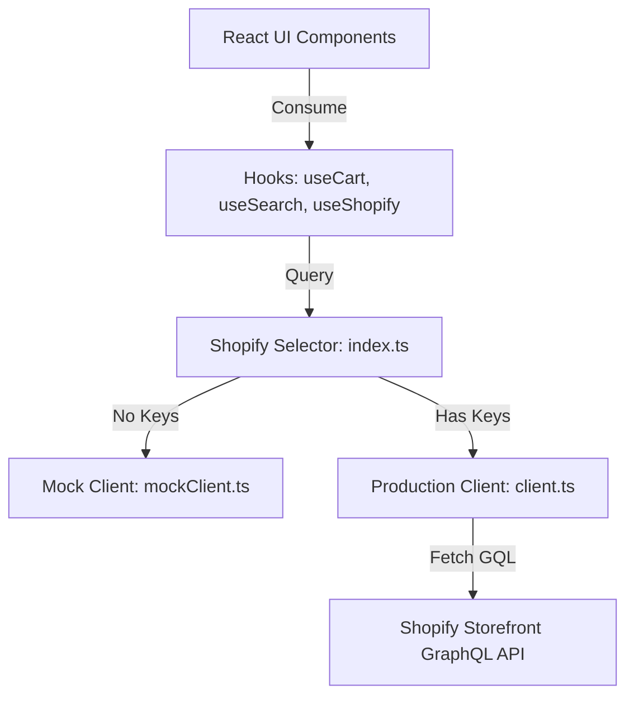

# AURA Fine Jewellery - Shopify Integration Architecture

This folder contains the integration utilities, schema guides, and raw GraphQL templates required to connect the React frontend to a live Shopify Storefront instance.

## Architecture Design

To ensure modularity and ease of maintenance, the data layer has been abstracted away from the UI components. No React components imports data objects or mock files directly. Instead, they interact with the unified Client interface located at `src/lib/shopify/index.ts`.



---

## Configuration & Setup

To switch from the Mock Client to the production Shopify Storefront API:

1. Locate your **Shopify Storefront Access Token** and **Shopify Domain** inside your Shopify Admin dashboard under:
   `Settings > Apps and sales channels > Develop apps > Create an app > API Credentials`.
2. Ensure you have granted the storefront API access scopes (`unauthenticated_read_product_listings`, `unauthenticated_read_product_tags`, `unauthenticated_read_collection_listings`, `unauthenticated_write_co_checkouts`).
3. Paste these keys into your local environment configuration file (`frontend/.env` or `frontend/.env.local`):

```env
VITE_SHOPIFY_DOMAIN=aura-maison.myshopify.com
VITE_STOREFRONT_TOKEN=a48f20b411ec5a4b75fbc0891d4e0e5c
VITE_API_VERSION=2024-04
```

4. Restart your Vite development server:
   ```bash
   npm run dev
   ```
   The selector (`src/lib/shopify/index.ts`) will automatically detect the credentials and route all requests through `client.ts` rather than `mockClient.ts`.

---

## Folder Sub-directories

- `storefront-api/graphql/`: Houses raw `.graphql` schema query strings and mutations (Products, Collections, Cart lifecycle, and Predictive search).
- `storefront-api/services/`: Base clients triggering HTTPS POST requests.
- `storefront-api/hooks/`: Modular hooks wrapping client requests.
